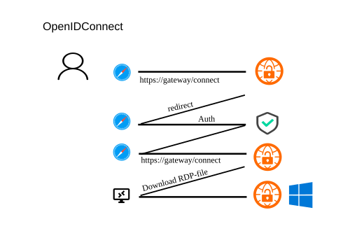

# OpenID Connect Authentication



RDPGW supports OpenID Connect authentication for the web UI and dashboard administration. In the homelab dashboard deployment, OIDC is used for `/` and `/admin`, while `local` and `ntlm` remain direct gateway authentication methods for native RDP clients.

## Configuration

To use OpenID Connect, ensure you have properly configured your OpenID Connect provider with a client ID and secret. The client ID and secret authenticate the gateway to the OpenID Connect provider. The provider authenticates the user and provides the gateway with a token, which generates a PAA token for RDP host connections.

```yaml
Server:
  Authentication:
    - openid
  SecureCookies: true # Recommended when HTTPS is terminated by a reverse proxy
OpenId:
  ProviderUrl: https://<provider_url>
  ClientId: <your_client_id>
  ClientSecret: <your_client_secret>
  GroupsClaim: groups
Dashboard:
  StorePath: ./data/dashboard
  UploadDir: ./data/dashboard/uploads
  IconDir: ./data/dashboard/icons
  AuthUsersPath: ./data/dashboard/auth-users.json
  AuthHelperConfigPath: ./data/dashboard/rdpgw-auth.yaml
  AdminGroups:
    - rdpgw-admins
  MaxUploadSizeMb: 5
  MaxTemplateUploads: 100
  MaxIconUploads: 100
  MaxTemplateUploadStorageMb: 100
  MaxIconUploadStorageMb: 100
Caps:
  TokenAuth: true
```

`Server.SecureCookies` defaults to `false` for local HTTP compatibility. Set it to `true` for external HTTPS deployments behind Traefik, Gateway API, or another TLS-terminating proxy so browser session cookies are always marked `Secure` even when rdpgw receives HTTP from the proxy.

### Dashboard + Group Configuration

When OpenID Connect is enabled, the homelab dashboard uses OIDC group membership for entry visibility and admin authorization:

- `OpenId.GroupsClaim`: claim name to read group memberships from the ID token. Default: `groups`.
- `Dashboard.StorePath`: directory for dashboard metadata (`entries.json`). Default: `./data/dashboard`.
- `Dashboard.UploadDir`: directory for uploaded `.rdp` templates. Default: derived from `StorePath` as `<StorePath>/uploads`.
- `Dashboard.IconDir`: directory for uploaded global web page icons managed from `/admin`. Default: derived from `StorePath` as `<StorePath>/icons`.
- `Dashboard.AuthUsersPath`: JSON file storing direct-auth users managed from `/admin`. Default: derived from `StorePath` as `<StorePath>/auth-users.json`.
- `Dashboard.AuthHelperConfigPath`: generated helper YAML consumed by `rdpgw-auth`. Default: derived from `StorePath` as `<StorePath>/rdpgw-auth.yaml`.
- `Dashboard.AdminGroups`: groups allowed to access `/admin` and admin APIs.
- `Dashboard.MaxUploadSizeMb`: max request upload size for template `.rdp` files and icon files. Default: `5`.
- `Dashboard.MaxTemplateUploads`: max number of stored uploaded `.rdp` template files. Default: `100`; `0` disables this quota.
- `Dashboard.MaxIconUploads`: max number of stored uploaded icon files. Default: `100`; `0` disables this quota.
- `Dashboard.MaxTemplateUploadStorageMb`: max total storage for uploaded `.rdp` templates. Default: `100`; `0` disables this quota.
- `Dashboard.MaxIconUploadStorageMb`: max total storage for uploaded icon files. Default: `100`; `0` disables this quota.

These dashboard group controls are web/OIDC controls. Entry `AllowedGroups` is evaluated for OIDC dashboard visibility and `.rdp` download access, and `Dashboard.AdminGroups` is evaluated for the admin UI. They are not evaluated for native RDP clients using direct authentication (`local` or `ntlm`). Direct-auth host authorization uses the addresses from enabled dashboard host entries as its host allowlist because those authentication modes do not carry reliable group claims.

Example:

```yaml
OpenId:
  ProviderUrl: https://keycloak.example.com/realms/homelab
  ClientId: rdpgw
  ClientSecret: your-secret
  GroupsClaim: groups
Dashboard:
  StorePath: /var/lib/rdpgw/dashboard
  UploadDir: /var/lib/rdpgw/dashboard/uploads
  IconDir: /var/lib/rdpgw/dashboard/icons
  AuthUsersPath: /var/lib/rdpgw/dashboard/auth-users.json
  AuthHelperConfigPath: /var/lib/rdpgw/dashboard/rdpgw-auth.yaml
  AdminGroups:
    - rdpgw-admins
    - homelab-admins
  MaxUploadSizeMb: 10
  MaxTemplateUploads: 100
  MaxIconUploads: 100
  MaxTemplateUploadStorageMb: 100
  MaxIconUploadStorageMb: 100
```

### Environment Variable Overrides

You can override the same settings via environment variables:

- `RDPGW_OPENID__GROUPSCLAIM`
- `RDPGW_DASHBOARD__STOREPATH`
- `RDPGW_DASHBOARD__UPLOADDIR`
- `RDPGW_DASHBOARD__ICONDIR`
- `RDPGW_DASHBOARD__AUTHUSERSPATH`
- `RDPGW_DASHBOARD__AUTHHELPERCONFIGPATH`
- `RDPGW_DASHBOARD__ADMINGROUPS`
- `RDPGW_DASHBOARD__MAXUPLOADSIZEMB`
- `RDPGW_DASHBOARD__MAXTEMPLATEUPLOADS`
- `RDPGW_DASHBOARD__MAXICONUPLOADS`
- `RDPGW_DASHBOARD__MAXTEMPLATEUPLOADSTORAGEMB`
- `RDPGW_DASHBOARD__MAXICONUPLOADSTORAGEMB`

Notes:

- `RDPGW_DASHBOARD__ADMINGROUPS` is space-separated (for example: `rdpgw-admins homelab-admins`).
- If `RDPGW_DASHBOARD__UPLOADDIR`, `RDPGW_DASHBOARD__ICONDIR`, `RDPGW_DASHBOARD__AUTHUSERSPATH`, or `RDPGW_DASHBOARD__AUTHHELPERCONFIGPATH` are not set, they are derived from `StorePath`.
- If `RDPGW_AUTH_HELPER_CONFIG` is set at runtime, the gateway writes the generated helper YAML there so the helper read path and generated output path stay aligned.

### Direct Auth Management

When dashboard mode is enabled, `/admin` manages two kinds of state:

- published host and template entries for OIDC users
- direct-auth users for `ntlm` and `local` gateway logins

The server regenerates the helper YAML after every direct-auth user change, and `rdpgw-auth` reloads that file automatically. In dashboard-managed direct-auth mode, enabled dashboard host entries are the native RDP host allowlist used by direct gateway auth.
Entry `AllowedGroups` does not further restrict these direct-auth connections; publish only host entries that should be reachable by any valid direct-auth user.
If the managed auth-user state or enabled host inventory is missing or invalid, direct `local` and `ntlm` auth fail closed.

## Authentication Flow

1. User navigates to `https://your-gateway/`
2. Gateway redirects to OpenID Connect provider for authentication
3. User authenticates with the provider (supports MFA)
4. Provider redirects back to gateway with authentication token
5. Gateway validates token and loads the dashboard or admin UI
6. Dashboard-managed direct-auth state is used by native RDP clients for `local` and `ntlm`

## Multi-Factor Authentication (MFA)

RDPGW provides multi-factor authentication out of the box with OpenID Connect integration. Configure MFA in your identity provider to enhance security.

## Provider Examples

### Keycloak
```yaml
OpenId:
  ProviderUrl: https://keycloak.example.com/realms/your-realm
  ClientId: rdpgw
  ClientSecret: your-keycloak-secret
```

### Azure AD
```yaml
OpenId:
  ProviderUrl: https://login.microsoftonline.com/{tenant-id}/v2.0
  ClientId: your-azure-app-id
  ClientSecret: your-azure-secret
```

### Google
```yaml
OpenId:
  ProviderUrl: https://accounts.google.com
  ClientId: your-google-client-id.googleusercontent.com
  ClientSecret: your-google-secret
```

## Security Considerations

- Always use HTTPS for production deployments
- Store client secrets securely and rotate them regularly
- Configure appropriate scopes and claims in your provider
- Enable MFA in your identity provider for enhanced security
- Set appropriate session timeouts in both gateway and provider

## Troubleshooting

- Ensure `ProviderUrl` is accessible from the gateway
- Verify redirect URI is configured in your provider (usually `https://your-gateway/callback`)
- Check that required scopes (openid, profile, email) are configured
- Validate that the provider's certificate is trusted by the gateway
